# 报告

本项目部署在**github**上：

[laishehao/database: 这个是正儿八经的数据库大作业！](https://github.com/laishehao/database)

## 大作业验收评分须知

1、大作业验收最晚18周五（2026.01.23）之前完成。
2、大作业验收，要求提交的资料内容：需求分析报告，概要设计，详细设计，系统使用说明书，小班讨论汇报及后期修改说明ppt，程序源码与数据库备份。
3、在验收的时候，组长先介绍系统设计的思路与整体功能，再当场运行程序演示系统功能。

### 评分细则：

#### 1）资料撰写50分

需求分析报告：6分
概要设计：6分
详细设计：12分
系统使用说明书：6分
小班讨论汇报及后期修改说明ppt：5分
程序源码与数据库备份：15分

#### 2）系统演示和讲解50分

系统演示与讲解（0-10分）：讲解不太清楚0-3分，讲解基本清楚4-7分，讲解清楚，设计熟悉8-10分；
程序运行（0-30分）：不能正常运行0-10分，能部分运行，可完成部分增删改查的操作11-20分，能正常运行，完成大部分的增删改查的操作21-30分；
程序功能（0-10分）：没有完成系统设计的功能0-2分，基本完成系统设计的功能3-6分，完成系统设计的功能，界面美观，功能流畅7-10分。

## 需求分析报告

### 主题：作业管理系统

**概要**：学生和老师以课程为纽带，布置作业，做作业，批改作业。就~~抄~~像学习通。

**主要模块**：

 #### sql：负责数据库管理，为Python提供存储过程的调用服务。

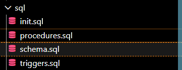	

init.sql:对数据库初始化；包括表的创建，数据注入和存储过程的调用测试。
procedure.sql：创建存储过程。包括所有存储过程的定义。
schema.sql：表的所有定义。
triggers.sql：触发器定义。

 #### python：接收前端数据，为前端提供数据；连接前后端。

	


my_app.py:用于接收前端的url请求，返回数据或错误。
my_log.py:初始换log对象用于记录url的请求，便于调试。
py_sql.py:处理my_app.py的数据库查询请求，调用存储过程并处理返回数据，返回json。

 #### vue（前端）：数据展示。


## 概要设计

### **前端框架**：（跟着说明书更有感觉!）

基于 **Vue 2** 的教务/教学管理系统前端示例，旨在为教师和学生提供一个集成的课程管理、学生档案维护以及作业发布与批改的平台。


### **数据库设计**：

### 1. 核心实体表 

| 表名         | 主键 | 描述       | 自增字段 |
| ------------ | ---- | ---------- | -------- |
| Teacher_Info | Tno  | 教师信息表 | Tno      |
| Student_Info | Sno  | 学生信息表 | Sno      |
| Course       | Cno  | 课程表     | Cno      |
| Work         | Wno  | 作业表     | Wno      |

### 2. 关联表 

| 表名         | 主键       | 描述       | 功能             |
| ------------ | ---------- | ---------- | ---------------- |
| SC           | (Cno, Sno) | 选课表     | 学生选课关系     |
| Write        | (Wno, Sno) | 学生作业表 | 学生作业完成情况 |
| Title_Image  | (Wno, Cno) | 题目图片表 | 存储作业题目图片 |
| Answer_Image | (Wno, Sno) | 答案图片表 | 存储学生答案图片 |

### 1. Teacher_Info

| 属性名    | 数据类型     | 约束               |
| --------- | ------------ | ------------------ |
| Tno       | INT          | 主键               |
| Tname     | VARCHAR(50)  | 非空               |
| Tpassword | VARCHAR(100) | 非空               |
| Temail    | VARCHAR(100) | 非空且唯一         |
| Tgender   | CHAR(1)      | 值只能为‘男’或‘女’ |
| Tphone    | VARCHAR(20)  | 非空且唯一         |
| Tavatar   | VARCHAR(200) | 唯一               |


### 2. Student_Info

| 属性名    | 数据类型     | 约束               |
| --------- | ------------ | ------------------ |
| Sno       | INT          | 主键               |
| Sname     | VARCHAR(50)  | 非空               |
| Spassword | VARCHAR(100) | 非空               |
| Semail    | VARCHAR(100) | 非空且唯一         |
| Sgender   | CHAR(1)      | 值只能为‘男’或‘女’ |
| Smajor    | VARCHAR(50)  |                    |
| Sphone    | VARCHAR(20)  | 非空且唯一         |
| Savatar   | VARCHAR(200) | 唯一               |


### 3. Course

| 属性名  | 数据类型     | 约束                                                         |
| ------- | ------------ | ------------------------------------------------------------ |
| Cno     | INT          | 主键且自增                                                   |
| Cname   | VARCHAR(100) | 非空                                                         |
| Cmajor  | VARCHAR(50)  |                                                              |
| Ccredit | INT          | 非空且唯一                                                   |
| Ctype   | VARCHAR(20)  | 值只能为‘必修’或‘选修’                                       |
| Tno     | INT          | 参照Teacher_Info(Tno)的外键，且添加(Cname, Tno)作为唯一性约束 |


### 4. SC

| 属性名 | 数据类型 | 约束                                              |
| ------ | -------- | ------------------------------------------------- |
| Cno    | INT      | 参照Course(Cno)的外键                             |
| Sno    | INT      | 参照Student_Info(Sno)的外键，且以(Cno, Sno)为主键 |


### 5. Work

| 属性名    | 数据类型     | 约束                  |
| --------- | ------------ | --------------------- |
| Wno       | INT          | 主键且自增            |
| Wtitle    | VARCHAR(200) | 非空                  |
| Cno       | INT          | 参照Course(Cno)的外键 |
| Wprogress | INT          | 默认值为0             |
| Wcontent  | TEXT         |                       |
| Wstart    | DATETIME     |                       |
| Wover     | DATETIME     |                       |


### 6. Write

| 属性名    | 数据类型     | 约束                                                        |
| --------- | ------------ | ----------------------------------------------------------- |
| Wno       | INT          | 非空，且为参照Work(Wno)的外键                               |
| Sno       | VARCHAR(200) | 非空，且为参照Student_Info(Sno)的外键，以(Wno, Sno)作为主键 |
| State     | INT          |                                                             |
| Wrcontent | INT          |                                                             |
| Score     | TEXT         |                                                             |
| Comment   | DATETIME     |                                                             |


### **中间层设计**：

#### 用户认证相关 

1. **GET /** - 主界面
2. **GET /test** - 测试数据库连接
3. **POST /register** - 用户注册
4. **POST /login** - 用户登录
5. **POST /api/user** - 修改用户信息

#### 学生管理相关 

1. **GET /student** - 查看学生列表
2. **POST /student** - 添加学生
3. **PUT /student/<int:studentId>** - 更新学生信息
4. **DELETE /student/<int:studentId>** - 删除学生

#### 课程管理相关 

1. **GET /course** - 查询课程列表
2. **POST /course** - 添加课程
3. **PUT /course/<int:courseId>** - 更新课程信息
4. **DELETE /course/<int:courseId>** - 删除课程

#### 作业管理相关 

1. **GET /homework** - 查看作业列表
2. **GET /homework/submissions** - 查看具体作业提交情况
3. **POST /homework** - 发布作业
4. **DELETE /homework/<int:workId>** - 删除作业
5. **PUT /homework/<int:workId>** - 更新作业信息
6. **POST /homework/submit/<int:workId>** - 学生提交作业
7. **GET /homework/<int:workId>** - 学生查看作业详情
8. **POST /homework/grade** - 老师批改作业

#### 系统概览 

1. **GET /dashboard/stats** - 获取仪表板统计信息，老师学生通用

#### 特点总结： 

1. **RESTful 风格**：使用了标准的 HTTP 方法（GET, POST, PUT, DELETE）
2. **路径参数**：使用 `<int:studentId>`等形式传递 ID
3. **查询参数**：通过 `request.args`获取
4. **JSON 数据**：通过 `request.get_json()`获取请求体
5. **CORS 配置**：允许跨域请求
6. **日志记录**：所有请求都有详细的日志记录
7. **错误处理**：通过 `abort()`和状态码返回错误信息
8. **角色权限**：通过 `role`参数区分学生和老师的不同操作权限

## 详细设计

### sql：详见:sql代码功能说明.pdf


### 中间层设计:

这个 Python 文件是一个数据库操作模块，主要包含对数据库存储过程的调用。以下是总结：

### 文件结构 

#### 1. 数据库连接配置 

```
connection = pymysql.connect(
    host=ip,  # 从JSON文件读取IP
    user='lzh',
    password='12345678',
    database='619database',
    port=3306,
    charset='utf8'
)
```

#### 2. 核心功能函数 

| 函数名              | 对应存储过程                                                 | 功能描述         | 调用场景           |
| ------------------- | ------------------------------------------------------------ | ---------------- | ------------------ |
| `test()`            | 无                                                           | 测试数据库连接   | 系统启动测试       |
| `register()`        | `S_Register`, `T_Register`                                   | 用户注册         | 学生/教师注册      |
| `login()`           | `S_Login`, `T_Login`, `View_Teacher`, `View_Student`         | 用户登录         | 登录验证           |
| `userinfo()`        | `Edit_Teacher`, `Edit_Student`                               | 修改用户信息     | 用户信息更新       |
| `select_student()`  | `View_Course_Student`, `Student_View_Work_List`              | 查看学生列表     | 教师查看课程学生   |
| `add_student()`     | `Select_Course`                                              | 添加学生到课程   | 教师添加学生       |
| `update_student()`  | `View_Student`                                               | 更新学生信息     | 修改学生信息       |
| `delete_student()`  | `Delete_Student_From_Course`                                 | 删除学生         | 从课程移除学生     |
| `select_course()`   | `Teacher_View_Course_List`, `View_Teacher`                   | 查看课程列表     | 教师查看课程       |
| `add_course()`      | `Create_Course`                                              | 创建课程         | 教师新增课程       |
| `update_course()`   | `Edit_Course`                                                | 编辑课程         | 修改课程信息       |
| `delete_course()`   | `Delete_Course`                                              | 删除课程         | 删除课程           |
| `select_work()`     | `Teacher_View_Work_List`, `Student_View_Work_List`           | 查看作业列表     | 教师/学生查看作业  |
| `add_work()`        | `Push_homework`                                              | 发布作业         | 教师发布作业       |
| `submit_work()`     | `Submit_Answer`                                              | 提交作业         | 学生提交作业       |
| `watch_work()`      | `View_homework`, `View_work`, `View_Course`                  | 查看作业详情     | 学生做作业界面     |
| `check_work()`      | `Teacher_View_Writes_By_Wno`, `View_Student`, `View_homework` | 查看作业提交情况 | 教师批改作业前查看 |
| `deal_work()`       | `Marking`                                                    | 批改作业         | 教师评分和评语     |
| `dashboard_stats()` | `TcntStudent`, `TcntCourse`, `TcntWriting`, `TcntCorrect`, `ScntCourse`, `ScntWriting` | 仪表板统计       | 主页数据展示       |

### 存储过程分类 

#### **用户管理类** 

- **注册相关**：`S_Register`, `T_Register`
- **登录验证**：`S_Login`, `T_Login`
- **信息查看**：`View_Student`, `View_Teacher`
- **信息修改**：`Edit_Student`, `Edit_Teacher`

#### **课程管理类** 

- **课程操作**：`Create_Course`, `Edit_Course`, `Delete_Course`, `View_Course`
- **选课管理**：`Select_Course`, `Delete_Student_From_Course`
- **列表查看**：`Teacher_View_Course_List`, `View_Course_Student`

#### **作业管理类** 

- **作业发布**：`Push_homework`
- **作业查看**：`Teacher_View_Work_List`, `Student_View_Work_List`, `View_work`
- **作业提交**：`Submit_Answer`, `View_homework`
- **作业批改**：`Marking`, `Teacher_View_Writes_By_Wno`

#### 统计功能类 

- **教师统计**：`TcntStudent`, `TcntCourse`, `TcntWriting`, `TcntCorrect`
- **学生统计**：`ScntCourse`, `ScntWriting`

### 代码特点 

#### 1. 统一异常处理 

```
try:
    # 数据库操作
except:
    connection.rollback()  # 异常时回滚
    raise
```

#### 2. 日志记录 

- 使用 `logger_py`记录操作日志
- 记录参数、调用过程和结果
- 便于调试和问题追踪

#### 3. 错误处理 

- 检查存储过程返回的ERROR信息
- 返回相应的错误码和消息
- 使用abort中断错误请求

### 数据流示例 

#### 教师查看学生列表 

```
前端请求 → select_student() → View_Course_Student存储过程 → 数据库查询 → 数据转换 → 返回JSON
```

#### 学生提交作业 

```
前端请求 → submit_work() → Submit_Answer存储过程 → 数据库更新 → 返回成功消息
```

### 前端设计

#### 1. 主要技术栈

| 技术             | 说明                                           |
| ---------------- | ---------------------------------------------- |
| **Vue.js 2.6.x** | 核心前端框架                                   |
| **Element UI**   | 桌面端 UI 组件库，用于快速构建表单、表格和弹窗 |
| **Vue Router**   | 官方路由管理器，支持单页应用导航               |
| **Vuex**         | 全局状态管理，用于存储用户信息和认证状态       |
| **Axios**        | 基于 Promise 的 HTTP 客户端，用于 API 交互     |
| **WangEditor**   | 轻量级 Web 富文本编辑器，用于作业内容编辑      |
| **Stylus**       | CSS 预处理器，提升样式编写效率                 |
| **RSA 加密**     | 用于登录/注册过程中的密码安全传输              |

#### 2. 文件分布结构说明

```
my-database-project/
├── public/                # 静态资源入口
│   ├── index.html         # HTML 模板
│   └── favicon.ico        # 站点图标
├── src/
│   ├── api/               # 底层 API 请求封装与拦截器
│   │   ├── http.js        # Axios 实例配置与拦截处理
│   │   └── common.js      # 公共请求方法封装
│   ├── assets/            # 静态资源 (图片、样式等)
│   ├── components/        # 公共组件库
│   │   ├── layout/        # 布局组件 (Header, SideMenu, DashBoard)
│   │   ├── features/      # 业务特性组件 (日历、统计卡片、轮播图等)
│   │   ├── modals/        # 业务弹窗组件 (登录、课程编辑、学生编辑等)
│   │   └── WangEditor.vue # 富文本编辑器封装
│   ├── config/            # 项目配置文件
│   │   ├── api.config.js  # API 路由与参数映射表
│   │   └── base.config.js # 基础常量配置
│   ├── plugins/           # 插件注册
│   │   ├── element.js     # Element UI 按需/全局引入
│   │   └── http.js        # 将 API 调用挂载至 Vue 原型 ($api)
│   ├── router/            # 路由配置 (index.js)
│   ├── store/             # Vuex 状态管理 (index.js)
│   ├── views/             # 页面级组件 (路由跳转的目标)
│   ├── App.vue            # 根组件
│   └── main.js            # 入口文件
├── .env.development       # 开发环境环境变量
├── jsconfig.json          # 编辑器智能路径提示配置
├── package.json           # 项目依赖与脚本配置
└── vue.config.js          # Vue CLI 配置文件

```

#### 3. 主要页面组成

1. **首页 (HomePage.vue)**:
   - 综合仪表盘，集成统计信息、教学日历、最近动态和推荐课程。
2. **学生管理 (StudentList.vue)**:
   - 展示学生列表，支持搜索、添加、修改和删除学生档案。
3. **课程管理 (CourseList.vue)**:
   - 管理课程目录，包含课程描述、任课教师等信息。
4. **作业系统**:
   - **作业列表 (HomeworkList.vue)**: 根据角色展示作业列表。
   - **作业详情 (HomeworkDetail.vue)**: 查看作业要求或进行作业提交。
   - **作业批改 (HomeworkGrading.vue)**: 教师对学生提交的作业进行评分和反馈。
   - **作业包装器 (HomeworkWrapper.vue)**: 作为容器组件，根据逻辑分发作业管理与查看权限。
5. **个人中心 (ProfilePage.vue)**:
   - 展示及修改当前登录用户的个人资料。

#### 4. 主要功能模块

**1 身份认证与安全**

- **登录/注册**: 支持多种角色的注册与登录。
- **RSA 加密**: 密码在传输前通过公钥加密，确保后端接收到的不是明文。
- **Token 管理**: 登录后自动保存 Token，并在后续请求头中自动携带。

**2 灵活的 API 驱动**

- 项目采用 **API 配置映射模式**。在 `api.config.js` 中定义每个接口的 URL、方法和特殊逻辑（如 `rest: true` 表示支持 RESTful 路径参数替换）。
- 通过 `this.$api({ apiType: 'key', rest: { id: 1 } })` 的方式调用，极大降低了维护成本。

**3 交互式仪表盘**

- **统计卡片 (StatsCards)**: 实时展示系统内的学生总数、课程总数等指标。
- **教学日历 (TeachingCalendar)**: 可视化展示教学计划安排。
- **消息轴 (NewsTimeline)**: 以时间轴形式展示系统公告或操作动态。

**4 数据管理功能 (CRUD)**

- **模块化弹窗**: 所有的增删改操作均通过 `src/components/modals/` 下的独立组件完成，保持页面逻辑简洁。
- **富文本编辑**: 集成 WangEditor，支持在发布作业时进行图文混排。

## 说明书

### 注册

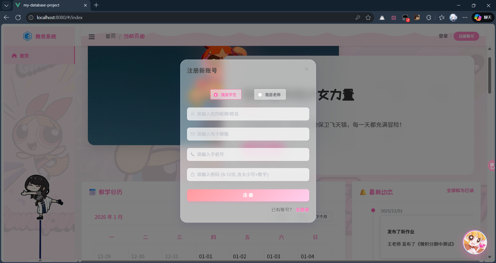

### 登录

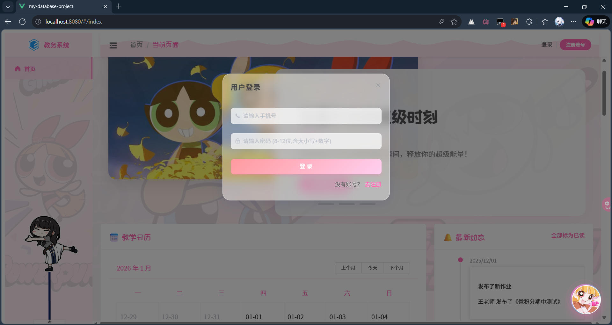

### 个人信息修改

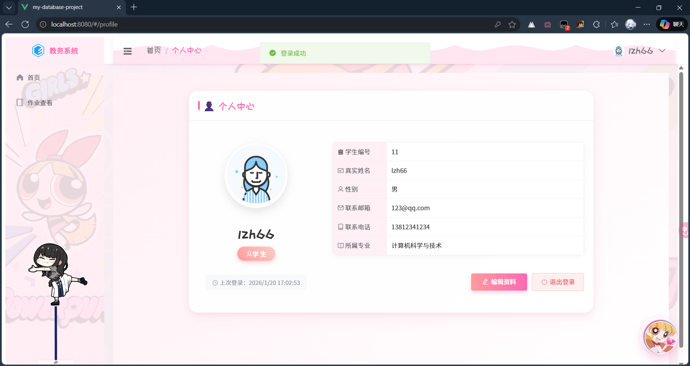

### 学生

#### 首页

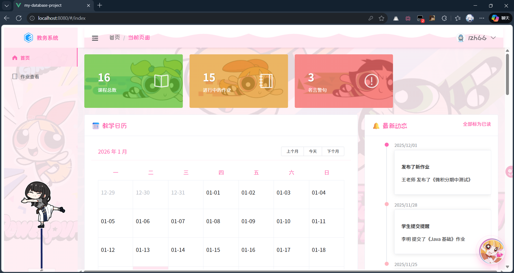

#### 作业查看

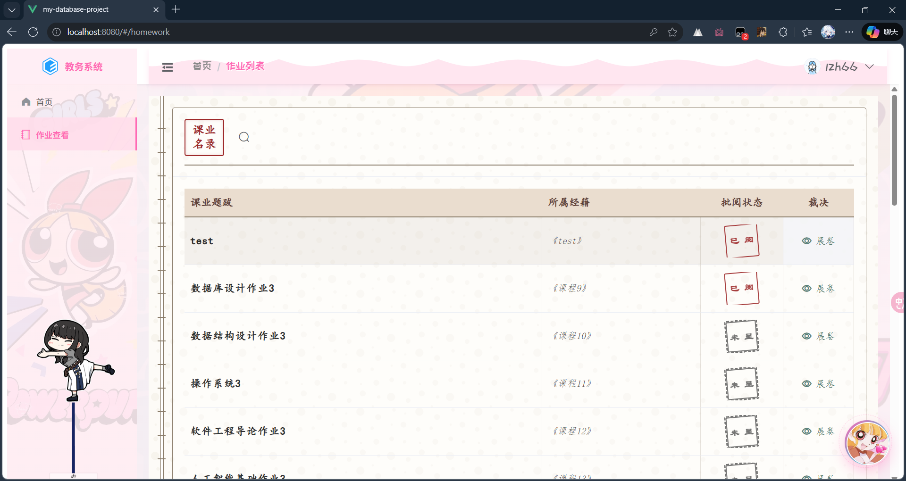

#### 做作业/看成绩

**成绩：**

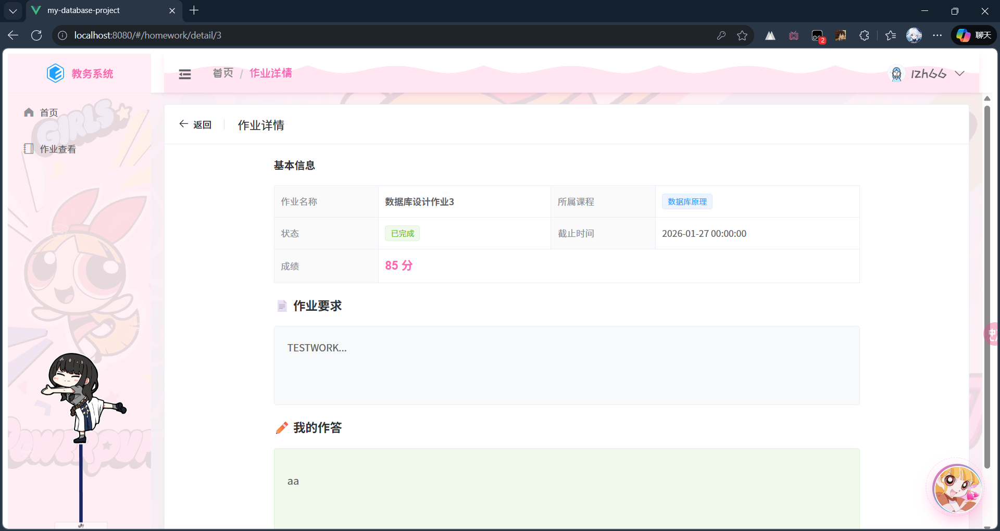

**做作业：**

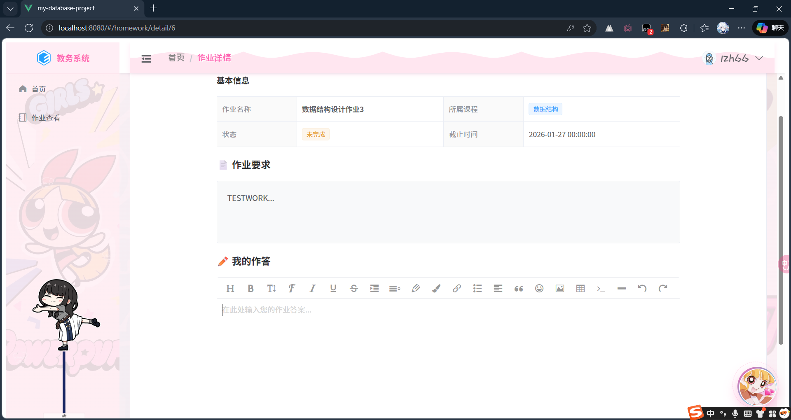

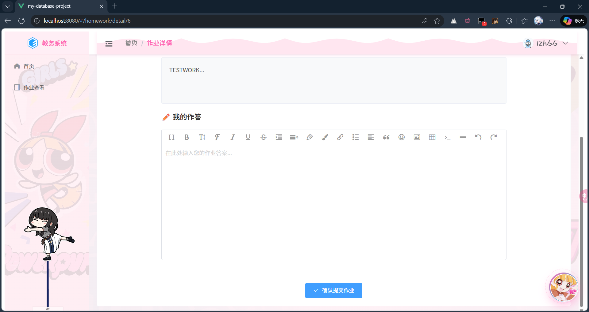

### 老师

#### 首页

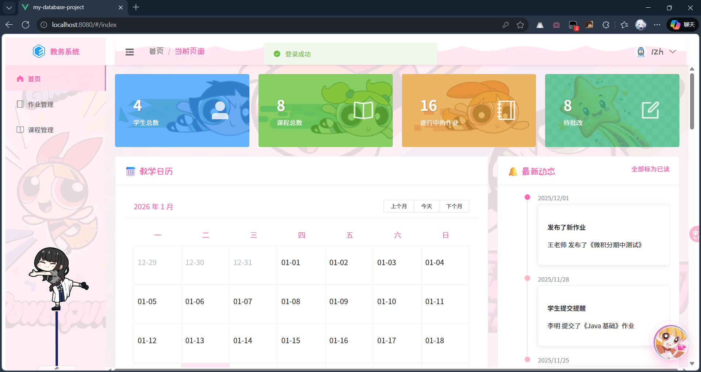

#### 作业管理

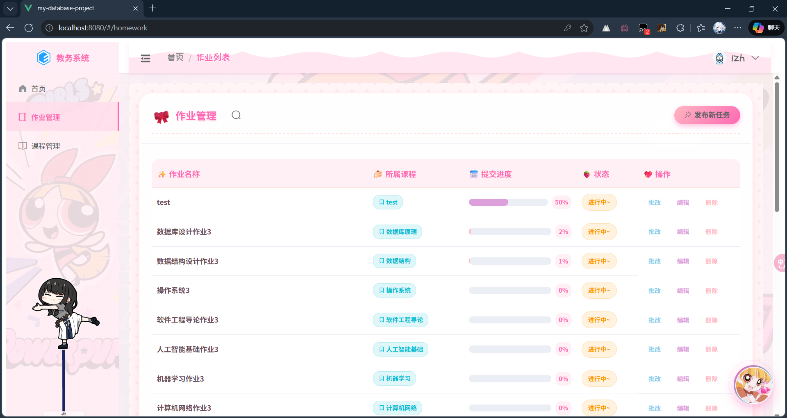

#### 发布作业


#### 编辑作业

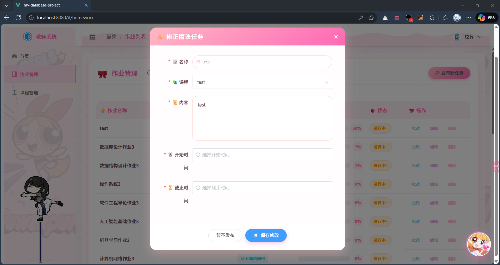

#### 删除作业

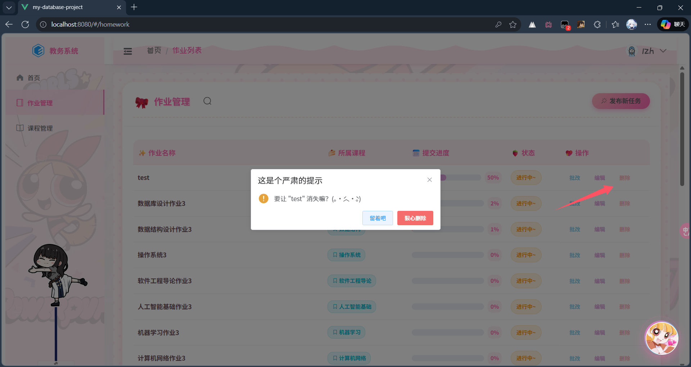

#### 批改作业

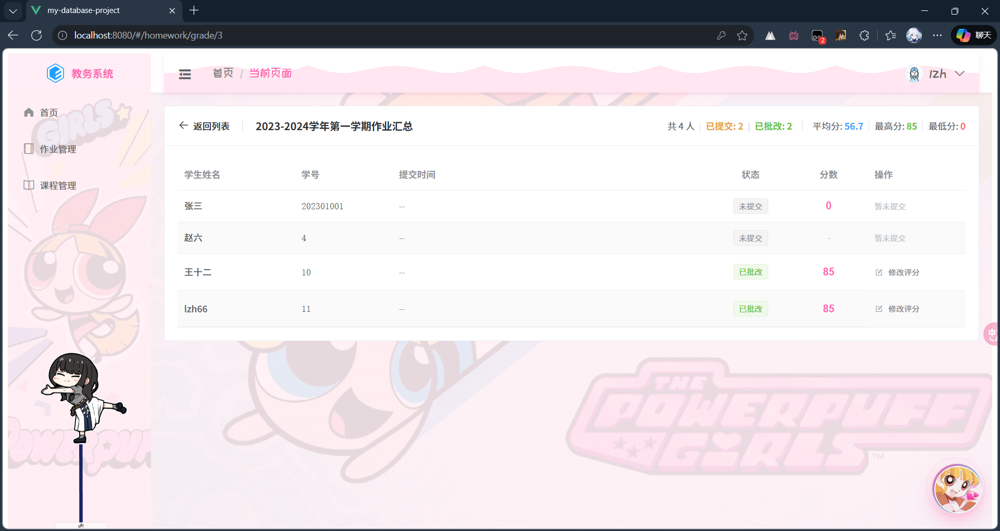

#### 课程管理

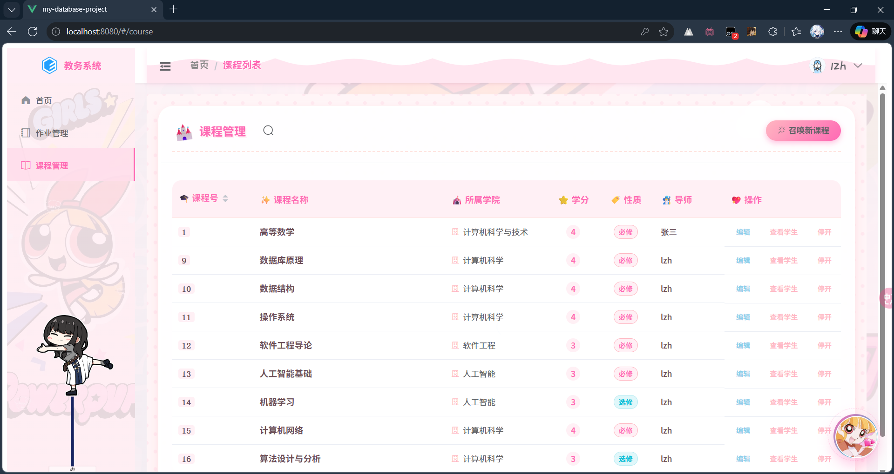

#### 开课


#### 删课

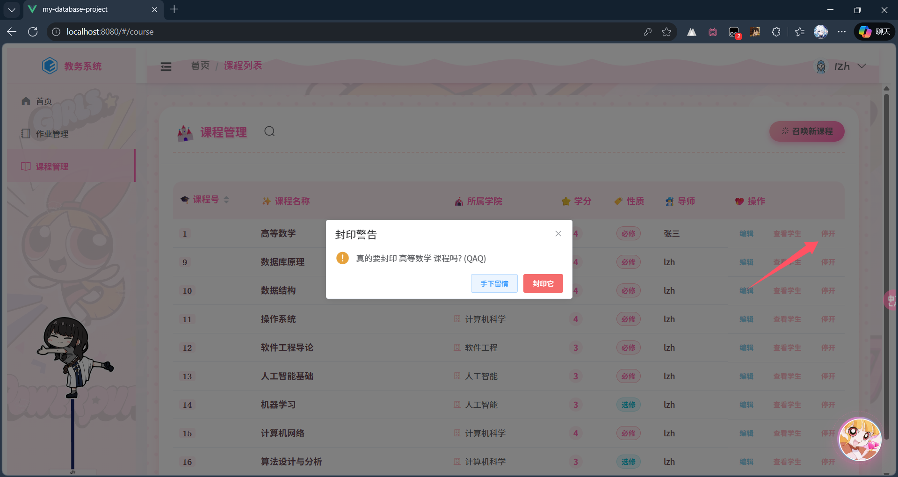

#### 查看选课了的学生

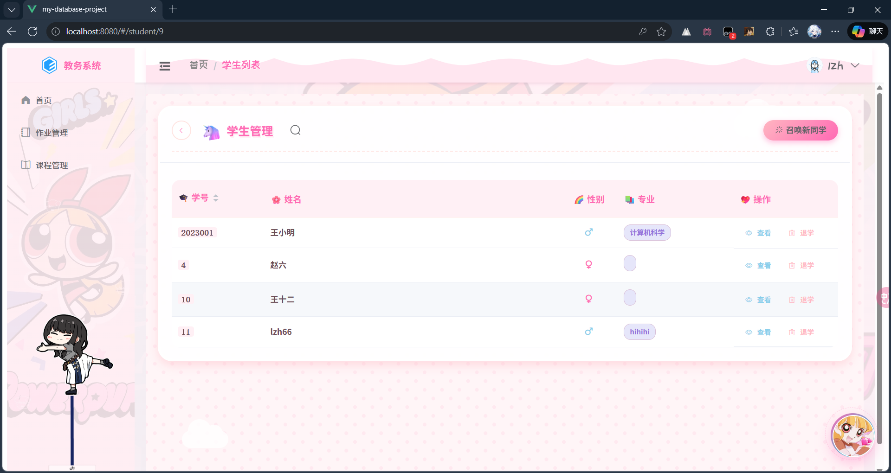

#### 加学生

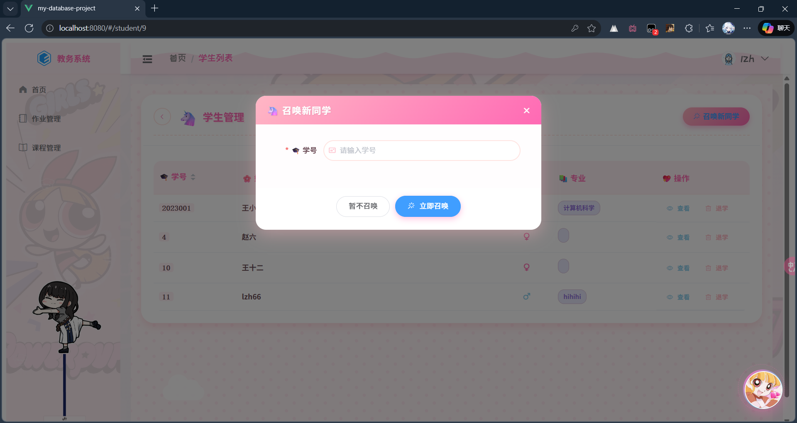

#### 删除学生

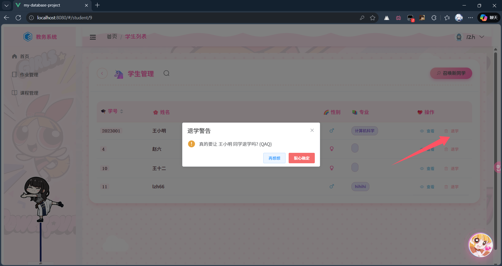

## 

